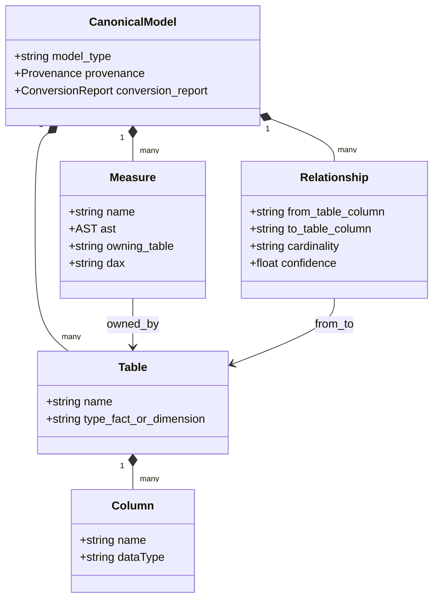

# Tableau → Power BI Semantic Compiler (`tab2pbi`)

A **deterministic** command-line tool that translates a Tableau workbook
(`.twbx`) into a Power BI **Tabular Object Model (TOM)** through a canonical
semantic intermediate representation (IR).

It preserves *analytical intent* (tables, measures, relationships) rather than
visual layout, and — importantly — it **never guesses**. Any calculation it
cannot translate with confidence is reported as unsupported, with a reason.
Nothing is dropped silently and no DAX is fabricated.

> **Status: early / honest.** One measure shape (single and algebraic-binary
> aggregations) is transpiled to DAX today. Most real-world Tableau
> calculations (LOD expressions, table calculations, window functions, complex
> conditionals) are **not** transpiled yet — they are classified and reported,
> not converted. See [What works today](#what-works-today). A real Tableau
> expression parser and a broader transpiler are planned (Phase 2).

---

## What it does

Given `examples/Superstore.twbx`, the pipeline produces a Power BI TOM model
(`data/powerbi_tom_model.json` and a Tabular Editor `data/Model.json`) plus a
full, auditable trail of intermediate artifacts.

Sample run output (Superstore):

```
 Tables:            3
 Measures total:    17
   converted:       1
   skipped:         16
 Relationships:     1
 Fact table:        Orders_… (inferred_by_size)
```

The single converted measure is table-qualified DAX:

```
[Calculation_1368…] = SUM(Orders_…[Profit]) / SUM(Orders_…[Sales])
```

and the inferred relationship (`Orders.Region → People.Region`, coverage 1.0)
comes from profiling the actual extract data, not from metadata guesses.

---

## Architecture

The compiler is a **staged pipeline** built around a single canonical
intermediate representation (IR). Each node below is a real module under
[`src/tab2pbi/`](src/tab2pbi/); solid arrows are data dependencies.


### Stage guarantees

Each stage is deterministic and writes an auditable JSON artifact. In terms of
input → output → the guarantee it upholds:

- **parse/tableau_xml** — `.twbx` → parsed fields, calculations, filters,
  parameters. *Guarantee:* only documented TWB XML structures are read.
- **parse/hyper** — `.hyper` → physical schema + a per-table data sample.
  *Guarantee:* official Hyper API only; every table is sampled (no silent
  single-table truncation).
- **parse/mapping** — logical fields + physical schema → exact, case-insensitive
  mapping. *Guarantee:* no fuzzy aliases; unmatched fields stay unmapped (later
  reported, never guessed).
- **ir/semantic_model** — calculations + schema → the AST-shaped IR, tables
  tagged fact/dimension. *Guarantee:* un-parseable calcs become `unsupported`
  nodes **with a reason**; the fact table is a labeled, overridable heuristic.
- **ir/context** — IR + mapping → measure→table ownership + table-qualified DAX.
  *Guarantee:* ambiguous fields prefer the fact table; unresolved fields are
  reported, not invented.
- **relationships/from_twb** — TWB XML → declared logical/physical relationships.
  *Guarantee:* query-time-deferred join keys are preserved as such.
- **relationships/from_hyper** — per-table data → inferred foreign keys.
  *Guarantee:* emitted only above a referential-coverage threshold; near-misses
  land in `unresolved_relationships`.
- **classify / rewrite** — IR → convertibility report + DAX. *Guarantee:*
  classification and translation are driven by the parsed AST, never substrings;
  anything not translated is skipped with a reason.
- **ir/canonical → ir/finalize** — assemble the tool-agnostic model + a full
  `conversion_report`. *Guarantee:* only genuinely-translated measures ship;
  skipped ones are enumerated with reasons.
- **export/tom → export/tabular_editor** — canonical model → Power BI TOM +
  Tabular Editor `Model.json`. *Guarantee:* measures without a reliable owning
  table are annotated, not attached with a guessed home.

### Why an intermediate representation?

Tableau and Power BI are **different analytical engines**, not two dialects of
one language. A direct string-to-string "translator" inevitably encodes
assumptions from one engine that are wrong in the other. The IR exists to make
those assumptions explicit and checkable:

| Tableau semantics | Power BI / DAX semantics | Why a naïve port breaks |
| ----------------- | ------------------------ | ----------------------- |
| **LOD** `{FIXED …}` and **table calcs** (`WINDOW_*`, `INDEX`, `RANK`) computed over the visual's addressing/partitioning | **Filter/row context** + `CALCULATE`; measures evaluate against the model, not a viz | The same formula means different things depending on visual context that does not survive migration |
| **Row-level vs aggregate** calcs distinguished at use-time | **Calculated column vs measure** must be decided at model-build time | A row-level `DATEDIFF` emitted as a measure is invalid DAX |
| **Deferred / query-time joins** (logical relationships) | **Explicit relationships** with cardinality + cross-filter direction | Cardinality must be resolved before the model loads |
| Field identity by caption, ambiguous across data sources | Column identity by `Table[Column]` | Measures need an unambiguous owning table |

The IR is an **engine-agnostic canonical model** (tables, typed columns,
measures-as-ASTs, relationships) sitting between the two. Every transformation
reads and writes the IR, so classification, DAX rewriting, and validation each
operate on the *same* structured object and each un-handled construct is
surfaced with a reason instead of being silently mistranslated.

### The IR data model



A `Measure.ast` is a small typed tree — this is the object the transpiler walks
to emit DAX and the object the classifier inspects to decide convertibility.
Today it has three node kinds (`single` aggregation, `binary` combination, and
`unsupported`-with-reason); the broader vocabulary (`conditional`, `function`,
`constant`) is added by the Phase-2 parser.

---

## Install

Requires **Python 3.10+** and the Tableau Hyper API (installed via
`requirements.txt`).

```bash
git clone <your-fork-url> tab2pbi
cd tab2pbi

python -m venv .venv
# Windows:
.venv\Scripts\activate
# macOS/Linux:
# source .venv/bin/activate

pip install -r requirements.txt
# optional: install the `tab2pbi` console command
pip install -e .
```

---

## Usage

Run the whole pipeline on the bundled sample workbook:

```bash
python run_pipeline.py --twbx examples/Superstore.twbx
```

Or, if you installed the package:

```bash
tab2pbi run examples/Superstore.twbx
```

Options:

| Flag | Meaning |
|------|---------|
| `--twbx PATH` | Workbook to compile (default `examples/Superstore.twbx`). |
| `--data-dir DIR` | Where artifacts are written (default `data/`). |
| `--extract-dir DIR` | Where the `.twbx` is unzipped (default `<data-dir>/twbx_extracted`). |
| `--fact-table NAME` | Override the inferred fact table (see below). |
| `-v/--verbose` | Debug logging. |

### Opening the result

`data/Model.json` is a Tabular Editor–compatible model. Open **Tabular Editor
2/3 → File → Open → From File…** and select it. See [`demo/`](demo/) for a
step-by-step walkthrough.

---

## What works today

| Capability | Status |
| ---------- | ------ |
| Unzip `.twbx`, parse `.twb` XML (fields, calcs, filters, parameters) | ✅ |
| Read `.hyper` schema and per-table data via the official Hyper API | ✅ |
| Logical→physical field mapping (exact, case-insensitive) | ✅ |
| AST for single aggregations (`SUM([x])`) and algebraic pairs (`SUM([a])/SUM([b])`) | ✅ |
| Table-qualified DAX for those shapes | ✅ |
| Data-driven relationship inference (PK/FK by referential coverage) | ✅ |
| Convertibility classification + skip-with-reason report | ✅ |
| Power BI TOM + Tabular Editor `Model.json` export | ✅ |
| LOD / table-calc / window / complex-conditional transpilation | ❌ reported, not converted |
| A real Tableau expression parser | ❌ Phase 2 |
| IR JSON-Schema validation, tests, CI, evaluation harness | ❌ Phase 2 |

### Fact vs. dimension is a heuristic

Tableau `.twbx` files do not declare fact/dimension roles. The default is a
**documented heuristic**: the physical table with the most columns is treated
as the fact table. This is recorded in the conversion report, and every measure
owned by that table is flagged (`"fact table inferred by size, not declared"`).
Override it explicitly with `--fact-table <PhysicalTableName>`.

---

## Pipeline stages

Each stage writes a JSON artifact under `data/`; a labeled reference copy lives
in [`examples/expected_output/`](examples/expected_output/).

| Stage | Module | Output |
| ----- | ------ | ------ |
| 1. Parse TWB XML | `parse/tableau_xml.py` | `parsed_tableau_*.json` |
| 2. Hyper schema + per-table data | `parse/hyper.py` | `parsed_hyper_schema.json`, `data/tables/*.csv` |
| 3. Logical→physical mapping | `parse/mapping.py` | `logical_physical_mapping.json` |
| 4. Semantic model (AST) | `ir/semantic_model.py` | `semantic_model.json` |
| 5. Relationships (declared) | `relationships/from_twb.py` | `relationships_from_twb.json` |
| 6. Relationships (data-driven) | `relationships/from_hyper.py` | `inferred_powerbi_relationships.json` |
| 7. Table-context resolution | `ir/context.py` | `semantic_model_with_context.json` |
| 8. Classification | `classify/classifier.py` | `calculation_classification.json` |
| 9. DAX rewrite | `rewrite/dax.py` | `converted_dax_measures.json` |
| 10. Canonical model | `ir/canonical.py` | `canonical_powerbi_model.json` |
| 11. Finalize + audit report | `ir/finalize.py` | `final_powerbi_semantic_model.json` |
| 12. TOM export | `export/tom.py` | `powerbi_tom_model.json` |
| 13. Tabular Editor model | `export/tabular_editor.py` | `Model.json` |

---

## Design principles

- **Deterministic** — same input, same output.
- **No silent drops / no fabrication** — unsupported → reason.
- **Heuristics are labeled and overridable.**
- **Official interfaces only** — Hyper API + documented TWB XML.

---

## Known limitations

- Only two calculation shapes are transpiled; everything else is reported.
- Relationship inference is coverage-based on the sampled extract data.
- No visual/dashboard migration — this is a semantic-model compiler.
- Not yet validated against Tableau-computed values (evaluation harness is
  Phase 2).

See [`CHANGELOG.md`](CHANGELOG.md) for what changed and
[`CONTRIBUTING.md`](CONTRIBUTING.md) for the development workflow.

## License

[MIT](LICENSE)
