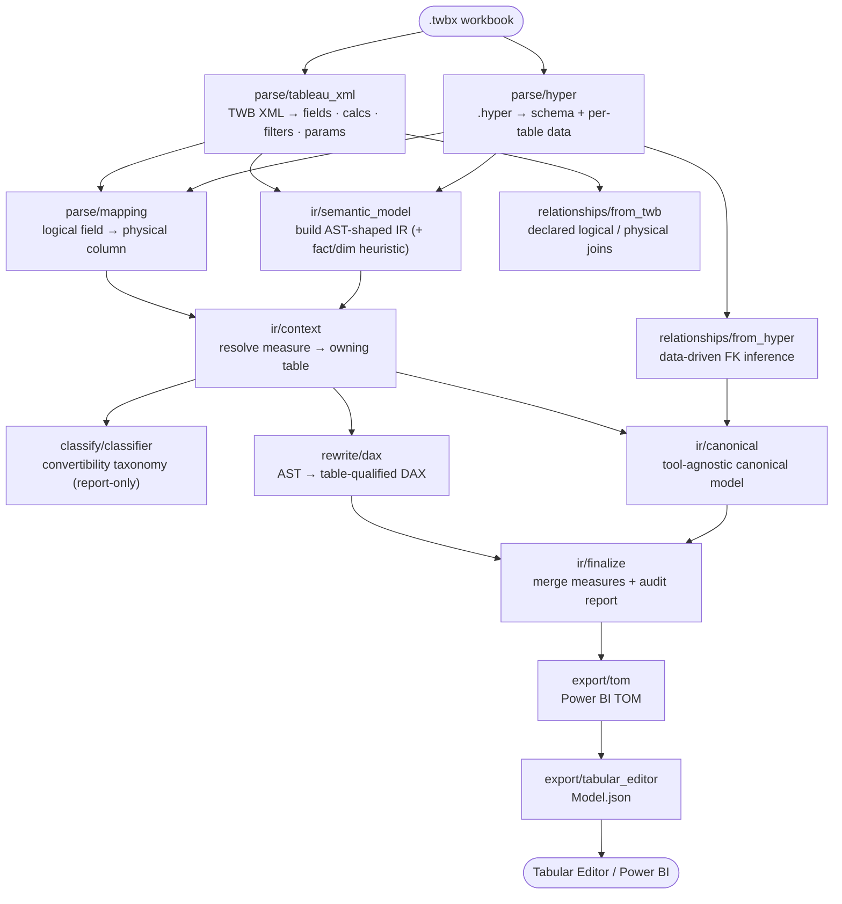
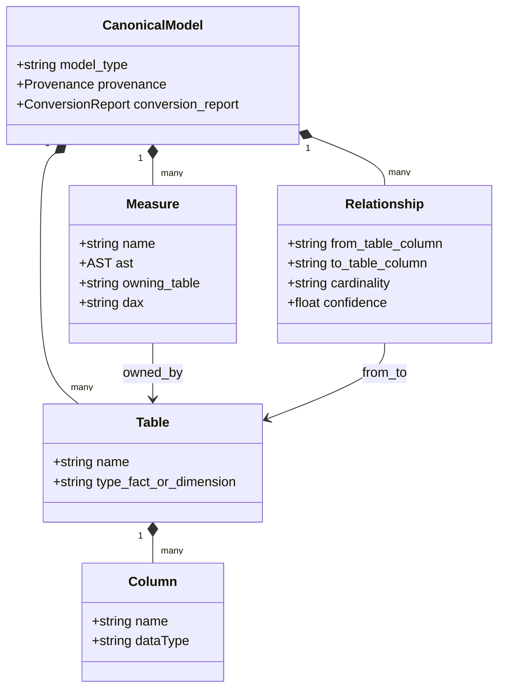

<div align="center">

# `tab2pbi`

### Tableau → Power BI, without the guesswork

A **deterministic compiler** that translates Tableau workbooks into Power BI —
the **semantic model** (Tabular Object Model) and, experimentally, the
**report visuals** (PBIR) — through a single canonical intermediate
representation. It preserves *analytical intent*, and when it can't translate
something faithfully it **says so, with a reason** — it never fabricates DAX,
mappings, or coverage.


</div>

---

> ### The one idea
> Most migration tools recreate dashboards and **silently** drop or approximate
> the calculations that carry the real analytical meaning. `tab2pbi` inverts the
> priorities: **engine-correctness over visual parity**, and **explicit
> uncertainty over silent failure**. Every calculation is either translated
> **or** reported in a machine-readable *failure taxonomy* — nothing vanishes,
> nothing is faked.

## Contents

- [Two compilers, one IR](#two-compilers-one-ir)
- [Results at a glance](#results-at-a-glance)
- [Quickstart](#quickstart)
- [Architecture](#architecture)
- [What works today](#what-works-today)
- [How correctness is measured](#how-correctness-is-measured)
- [Pipeline stages](#pipeline-stages)
- [Design principles](#design-principles)
- [Limitations](#limitations)
- [Development](#development)
- [Documentation map](#documentation-map)

---

## Two compilers, one IR

| | **Data-model compiler** | **Visual compiler** `V1 · experimental` |
| --- | --- | --- |
| **Translates** | `.twbx` → Power BI **TOM** (tables, measures, relationships) | `.twb` worksheets → Power BI **PBIR** report (`visual.json`) |
| **Command** | `tab2pbi run` | `tab2pbi visual` |
| **Output** | `data/Model.json`, `data/powerbi_tom_model.json` | `data/visual_report/Superstore.Report/` |
| **Verification** | proxy **1/1** · engine-verified **1/1** (n=1) | render-gate **pending** |
| **Docs** | [ARCHITECTURE](docs/ARCHITECTURE.md) · [EVALUATION](docs/EVALUATION.md) | [VISUAL](docs/VISUAL.md) |

Both share the discipline: **deterministic, no silent drops, heuristics
labeled.** The two halves currently target *different* models (the visual
compiler binds to a flat spike model; unifying it with the multi-table TOM + a
TMDL emitter is **V2**) — this gap is documented, not hidden.

## Results at a glance

Compiling the bundled **Superstore** workbook (`examples/Superstore.twbx`):

**Semantic model** — 17 calculations →

| | | |
| --- | --- | --- |
| measures | **3** | `Profit/Sales`, YoY% (`SUMX`+`COALESCE`), a `SWITCH` classifier |
| calc column | **1** | `DATEDIFF(Orders[Order Date], Orders[Ship Date], DAY)` |
| parameters | **4** | constant calcs (own bucket) |
| skipped | **9** | each with a taxonomy reason |
| **coverage** | **23.5%** | measures + columns / total |
| relationship | **1** | `Orders.Region → People.Region` (coverage 1.0, data-driven) |
| correctness | **proxy 2/2 · engine-verified 1/1** | *tol 1e-3 — YoY engine-check pending* |

**Report visuals** — 32 worksheets →

| | | |
| --- | --- | --- |
| emitted | **11** | columnChart ×5, tableEx ×2, map/area/pie/line ×1 |
| skipped | **21** | `custom_shape` 11 · `insufficient_fields` 7 · `custom_geometry` 1 · `gantt` 1 · `dual_axis` 1 |
| **coverage** | **34.4%** | emitted & schema-valid / total *(NOT render-verified)* |

> **Coverage is a floor, not a ceiling.** Superstore is a design showcase
> dominated by table calcs, window functions, string-formatting logic, and
> custom-shape/geometry marks that are *genuinely* out of scope. A low, honest
> number beats a high, wrong one — that's the whole point.

## Quickstart

**Requires** Python 3.10+ and the Tableau Hyper API (in `requirements.txt`).

```bash
git clone <your-fork-url> tab2pbi && cd tab2pbi
python -m venv .venv && source .venv/bin/activate   # Windows: .venv\Scripts\activate
pip install -e .            # installs the `tab2pbi` command + deps
```

```bash
# 1) Compile the semantic model (writes data/*.json + Tabular Editor Model.json)
tab2pbi run examples/Superstore.twbx

# 2) Compile the report visuals (V1, experimental)
tab2pbi visual --report-json data/visual_report/visual_conversion_report.json

# 3) Check translation correctness against Tableau ground truth
python eval/evaluate.py --ground-truth examples/eval/ground_truth_superstore.csv --tolerance 1e-3
```

No install? Use `python run_pipeline.py --twbx …` and `python -m tab2pbi.visual …`.

**Open the result:** `data/Model.json` opens directly in **Tabular Editor 2/3**
(File → Open → From File…); the report render-gate is in
[`docs/VISUAL.md`](docs/VISUAL.md).

**Prefer a browser?** [`demo/`](demo/) is a self-service web app (FastAPI +
React) — upload a `.twbx`, see the conversion report, and download a portable
`.pbip`.

<details>
<summary><code>tab2pbi run</code> options</summary>

| Flag | Meaning |
| ---- | ------- |
| `--twbx PATH` | Workbook to compile (default `examples/Superstore.twbx`). |
| `--data-dir DIR` | Where artifacts are written (default `data/`). |
| `--extract-dir DIR` | Where the `.twbx` is unzipped. |
| `--fact-table NAME` | Override the inferred fact table (it's a labeled heuristic — largest table by column count). |
| `-v/--verbose` | Debug logging. |

</details>

## Architecture

A **staged pipeline** around one engine-agnostic IR. Every node is a real module
under [`src/tab2pbi/`](src/tab2pbi/); each stage is deterministic and writes an
auditable JSON artifact.



> **Note:** `relationships/from_twb` (node **G**) is intentionally drawn with no
> outgoing edge — declared TWB relationships are *extracted and audited* but not
> yet *merged* into the model (see [Limitations](#limitations)).

<details>
<summary><b>Stage guarantees</b> — input → output → the invariant each upholds</summary>

- **parse/tableau_xml** — `.twbx` → fields, calcs, filters, parameters. *Only
  documented TWB XML structures are read.*
- **parse/hyper** — `.hyper` → schema + per-table data sample. *Official Hyper
  API only; every table sampled (no silent single-table truncation).*
- **parse/mapping** — logical + physical → exact, case-insensitive mapping. *No
  fuzzy aliases; unmatched fields stay unmapped, later reported.*
- **ir/semantic_model** — calcs + schema → AST IR, tables tagged fact/dimension.
  *Un-parseable calcs become `unsupported` nodes with a reason; the fact table is
  a labeled, overridable heuristic.*
- **ir/context** — IR + mapping → measure→table ownership + table-qualified DAX.
  *Ambiguous fields prefer the fact table; unresolved fields are reported, not
  invented.*
- **relationships/from_twb** — declared relationships. *Query-time-deferred join
  keys preserved as such.* **Known gap:** audited but not merged into the model.
- **relationships/from_hyper** — per-table data → inferred foreign keys. *Emitted
  only above a referential-coverage threshold; near-misses → `unresolved`.*
- **classify / rewrite** — IR → convertibility report + DAX. *Driven by the
  parsed AST, never substrings; anything not translated is skipped with a reason.*
- **ir/canonical → ir/finalize** — assemble the model + full `conversion_report`.
  *Only genuinely-translated measures ship; skipped ones are enumerated.*
- **export/tom → export/tabular_editor** — TOM + `Model.json`. *Measures without
  a reliable owning table are annotated, not attached with a guessed home.*

</details>

### Why an intermediate representation?

Tableau and Power BI are **different analytical engines**, not two dialects of
one language. A string-to-string "translator" inevitably bakes in assumptions
from one engine that are wrong in the other. The IR makes those assumptions
explicit and checkable:

| Tableau semantics | Power BI / DAX semantics | Why a naïve port breaks |
| ----------------- | ------------------------ | ----------------------- |
| **LOD** `{FIXED …}` & **table calcs** (`WINDOW_*`, `INDEX`, `RANK`) over the viz's addressing/partitioning | **Filter/row context** + `CALCULATE`; measures evaluate against the model, not a viz | the same formula means different things per visual context, which doesn't survive migration |
| **Row-level vs aggregate** distinguished at *use* time | **Calculated column vs measure** decided at *build* time | a row-level `DATEDIFF` emitted as a measure is invalid DAX |
| **Deferred / query-time joins** | **Explicit relationships** w/ cardinality + cross-filter direction | cardinality must resolve before the model loads |
| Field identity by caption | Column identity as `Table[Column]` | measures need an unambiguous owning table |

<details>
<summary><b>The IR data model</b> (class diagram)</summary>



A `Measure.ast` is a typed tree from the tokenizer + Pratt parser
(`ir/tokenizer.py`, `ir/parser.py`) — node kinds `constant`, `field`,
`aggregation`, `binary`, `comparison`, `logical`, `not`, `unary`, `conditional`,
`function`, plus `unsupported`/`parse_error` (each with a reason). Full spec in
[`docs/ARCHITECTURE.md`](docs/ARCHITECTURE.md).

</details>

## What works today

| Capability | Status |
| ---------- | ------ |
| Unzip `.twbx`, parse `.twb` XML (fields, calcs, filters, parameters) | Done |
| Read `.hyper` schema + per-table data via the official Hyper API | Done |
| Logical→physical field mapping (exact, case-insensitive) | Done |
| Real tokenizer + Pratt parser → typed calc AST | Done |
| DAX for aggregations, algebraic combos, `COUNTD`, `IF`/`CASE`, basic date fns | Done |
| Measure vs. calculated-column split; constants → parameters | Done |
| Data-driven relationship inference (PK/FK by referential coverage) | Done |
| Machine-readable failure taxonomy + skip-with-reason report | Done |
| Versioned IR JSON-Schema validation of every stage | Done |
| pytest suite (58 tests) + GitHub Actions CI (pytest + ruff) | Done |
| Evaluation harness (proxy + engine-verified correctness) | Done |
| Power BI **TOM** + Tabular Editor `Model.json` export | Done |
| **PBIR report** emitter (core charts + bubble maps), V1 | Done |
| LOD / table-calc / window / conditional-aggregation transpilation | Reported, not converted |
| Merging declared TWB relationships into the model | Extracted only |
| Unifying visual bindings with the multi-table TOM + TMDL emitter | Planned (V2) |

## How correctness is measured

Two numbers, **never conflated** (the same discipline the whole project runs on):

- **Proxy-correctness** — an in-repo pandas evaluator walks the measure AST over
  the extract data and compares to Tableau. It validates the **parser/IR**, not
  the generated DAX (it executes no DAX). Superstore: **1/1**.
- **Engine-verified** — a value read from **Power BI** (after loading the model)
  vs Tableau. This is the real anchor. Superstore: **1/1** for the convertible
  measure — `n=1`, at a hand-read tolerance of `1e-3` (the Power BI value was
  read to 4 decimals; at `1e-6` the same run shows a rounding-only mismatch).

The report visuals have their own gate: **schema-valid ≠ rendered.** Coverage is
labeled "NOT render-verified" until the visuals are confirmed in Power BI Desktop
(steps in [`docs/VISUAL.md`](docs/VISUAL.md)). Method + threats to validity:
[`docs/EVALUATION.md`](docs/EVALUATION.md).

## Pipeline stages

Each stage writes a JSON artifact under `data/`; a labeled reference copy lives in
[`examples/expected_output/`](examples/expected_output/).

| # | Stage | Module | Output |
| - | ----- | ------ | ------ |
| 1 | Parse TWB XML | `parse/tableau_xml.py` | `parsed_tableau_*.json` |
| 2 | Hyper schema + data | `parse/hyper.py` | `parsed_hyper_schema.json`, `tables/*.csv` |
| 3 | Logical→physical map | `parse/mapping.py` | `logical_physical_mapping.json` |
| 4 | Semantic model (AST) | `ir/semantic_model.py` | `semantic_model.json` |
| 5 | Relationships (declared) | `relationships/from_twb.py` | `relationships_from_twb.json` |
| 6 | Relationships (data-driven) | `relationships/from_hyper.py` | `inferred_powerbi_relationships.json` |
| 7 | Table-context resolution | `ir/context.py` | `semantic_model_with_context.json` |
| 8 | Classification | `classify/classifier.py` | `calculation_classification.json` |
| 9 | DAX rewrite | `rewrite/dax.py` | `converted_dax_measures.json` |
| 10 | Canonical model | `ir/canonical.py` | `canonical_powerbi_model.json` |
| 11 | Finalize + audit | `ir/finalize.py` | `final_powerbi_semantic_model.json` |
| 12 | TOM export | `export/tom.py` | `powerbi_tom_model.json` |
| 13 | Tabular Editor model | `export/tabular_editor.py` | `Model.json` |

## Design principles

- **Deterministic** — same input, same output.
- **No silent drops / no fabrication** — anything unsupported is reported with a reason.
- **Heuristics are labeled and overridable** — e.g. the fact-table pick is flagged in the report.
- **Official interfaces only** — Hyper API + documented TWB XML; no reverse-engineering.

## Limitations

- **Declared TWB relationships are extracted but not merged** into the model —
  only data-driven relationships reach the TOM.
- **LOD, table/window calcs, and conditional/parameter-dependent aggregations**
  are reported (with taxonomy), not transpiled.
- **Relationship inference** is coverage-based on the sampled extract data.
- **Visual compiler (V1)** emits the *report only* and binds to a flat spike
  model, not the multi-table TOM — unification + a TMDL model emitter is **V2**.
  Its coverage is schema-valid, not yet render-verified.
- **Evaluation** compares grand totals; per-dimension checks and multi-measure
  engine verification are future work.

## Development

```bash
pip install -e ".[dev]"
pytest -q                                # 58 tests: unit + golden E2E (model & visual)
ruff check src tests run_pipeline.py eval
python eval/evaluate.py --ground-truth examples/eval/ground_truth_superstore.csv --tolerance 1e-3
```

## Documentation map

| Doc | What's inside |
| --- | ------------- |
| [`docs/ARCHITECTURE.md`](docs/ARCHITECTURE.md) | IR spec, the semantic-mismatch discussion, related work |
| [`docs/EVALUATION.md`](docs/EVALUATION.md) | The two correctness numbers, the shared-AST threat to validity, how to export ground truth |
| [`docs/VISUAL.md`](docs/VISUAL.md) | V1 visual compiler: usage, scope, and the render-gate |
| [`docs/paper/`](docs/paper/) | Tool-demo paper draft + references |
| [`examples/README.md`](examples/README.md) | Corpus provenance & licensing |
| [`CHANGELOG.md`](CHANGELOG.md) · [`CONTRIBUTING.md`](CONTRIBUTING.md) | History & how to contribute |

---

<div align="center">

Built with a bias for **honest engineering** — the numbers are small because
they're real. · [MIT](LICENSE)

</div>
